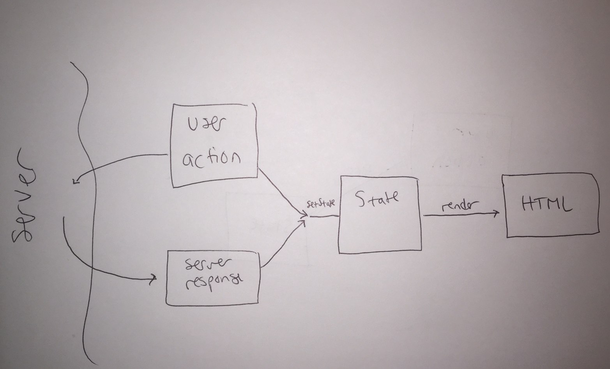

# "State" and "Render"
One of the key ideas of UI programming is to keep the `state` of the UI separate from what the user actually sees and interacts with.  This is a powerful way to keep programs simple as you add more features, interactions and visualizations.

The example project and assignment use this idea, which we talked about in class Wednesday.  Here's a diagram showing how this works conceptually, and how actions and events that occur relate to the pieces of code like `state`, `render`, and `setState` in these programs.

## Walkthrough the diagram
1. We start with some initial representation of the UI's `state` ([in the code](https://github.com/kevinrobinson/drexel-ui-programming/blob/master/v6/src/app_component.js#L38)).
2. The `render` function takes this `state` and updates the HTML on the page so user can see and interact with it ([in the code](https://github.com/kevinrobinson/drexel-ui-programming/blob/master/v6/src/app_component.js#L169)).
3. The only way to change what the user sees is through `setState`.  Only code in `render` should update the HTML on the page that the user sees.  When `setState` is called, it takes care of updating `this.state` to the new value, and it also calls `render` to make sure the user sees the latest state ([in the code](https://github.com/kevinrobinson/drexel-ui-programming/blob/master/v6/src/app_component.js#L60)).
4. If no other action occurs in the app, it will happily just sit there.  But in real apps things do happen, and the two most important kinds are: events from user interactions, and receiving new data from the server.
5. When a user interaction occurs, it's the programmer's job to figure out the right way to update the `state` of the UI using `setState` ([example](https://github.com/kevinrobinson/drexel-ui-programming/blob/master/v6/src/app_component.js#L128)).  That will also lead to a call to `render` to update the HTML on the page.  Code that's handling user interactions shouldn't update the HTML directly, let `render` do that.
6. After a user interaction, this is often something we want to save on the server as well, by making an HTTP request ([example](https://github.com/kevinrobinson/drexel-ui-programming/blob/master/v6/src/app_component.js#L85)).
7. When the server response finally comes back, we want our application to use that new data.  So when handling a server response, it's the programmer's job to figure out how to update `state` ([example](https://github.com/kevinrobinson/drexel-ui-programming/blob/master/v6/src/app_component.js#L120)).  Code that's handling data coming back from the server shouldn't update the HTML directly.  That's what `render` is for.

#### Note about the .innerHTML implementation
If you've done web programming before, particularly using some patterns from the jQuery community or from reading Stack Overflow, this separation may seem a little strange.  This is because in practice, there are often edge cases where simply re-rendering the HTML on the page would lose some part of the UI that would be jarring to the user experience.  For example, if the user is typing in a text box, the position of their cursor in the textbox is really important, and the implementation of simply setting `.innerHTML` like we do in this project would disrupt that ([in the code]((https://github.com/kevinrobinson/drexel-ui-programming/blob/master/v6/src/app_component.js#L183)).  Scrolling is another critical part of the user experience that is affected by this implementation.

While these are critical parts of the user experience, managing this is still the responsibilty of the `render` method.  The `render` method may have to use more complex strategies for certain situations like this, like only partially update the HTML on the page.  That's still fits with the core simplification that "state describes the UI" and "render takes the state and shows it to the user."